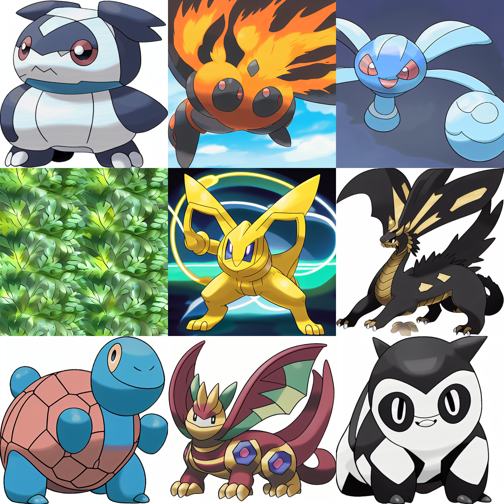

# Poké Forge Generator

Tiny toolkit for training and sampling a Poké-themed Stable Diffusion LoRA.

## What you get
- `train.py` – optional LoRA training entry point.
- `generate_some.py` – geneate some creature based on predefined prompts.
- `inference.py` – single prompt.
- `sanity_check.py` – quick script to verify that the LoRA was properly loaded.

## Prerequisites
1. Python 3.10+ and (ideally) a CUDA GPU.
2. A LoRA exported into `pokeforge_lora/unet_lora` and `pokeforge_lora/text_encoder_lora`.
3. Dependencies:
   ```bash
   python3 -m venv .venv
   source .venv/bin/activate
   pip install -r requirements.txt
   ```

## Train a new LoRA
```bash
python train.py
```
You can customize training parameters directly in `train.py` like `LEARNING_RATE`, `BATCH_SIZE`, `NUM_EPOCHS`, etc.

## Generate one Creature
```bash
python inference.py
```
You can customize the prompt directly in `inference.py`.

## Generate multiple Creatures
```bash
python generate_some.py
```
- You can modify and customize the prompts on the `PROMPTS` list in `generate_some.py`.

## Demo images
A few samples produced with the script (see `samples_pokeforge/`):


